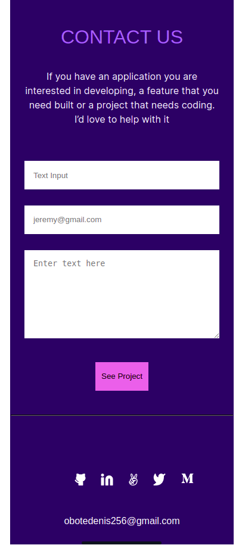

## My portfolio mobile version

This project is profile portfolio and deploying webpages on github pages in Microserve bootcamp week 3 day 1.

Project day 1 week 3 of Microserve bootcamp, module 1

## Built With

- node
- hmtl
- css
## Live Demo

[Live Demo Link](https://obote.github.io/Profile/)

### Install
- Node dependencies

## Authors

👤 **Author1**

- GitHub: [@Obote](https://github.com/Obote)
- Twitter: [@Obote_denis](https://twitter.com/Obote_denis)
- LinkedIn: [Obote Denis](https://www.linkedin.com/in/obote-denis-9859a2a3/)

## 🤝 Contributing

Contributions, issues, and feature requests are welcome!

Feel free to check the [issues page](../../issues/).

## Show your support

Give a ⭐️ if you like this project!

## Acknowledgments
- @leonardoeng13 for helping in pair programing
- Hat tip to anyone whose code was used
- Inspiration
- Microverse

## 📝 License

This project is [MIT](./MIT.md) licensed.